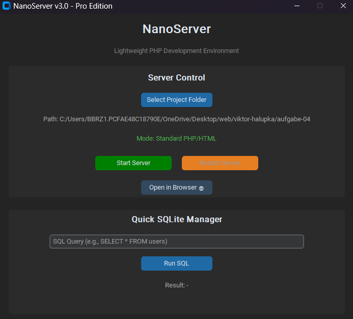

# NanoServer

**A lightweight, modern PHP development environment for students and developers.**

NanoServer is a portable, GUI-based tool written in Python that replaces heavy software like XAMPP or Laragon for simple development tasks. It uses the built-in PHP web server and SQLite, wrapped in a modern Dark Mode interface.


<br> 

<br>

## Features

* **Zero Configuration:** Just select your project folder and click Start.
* **Modern UI:** Clean, Dark Mode interface using `CustomTkinter`.
* **Lightweight:** No Apache/Nginx installation required. Uses `php -S`.
* **Laravel Support:** Automatically detects Laravel projects and serves from the `/public` directory.
* **SQLite Manager:** Built-in tool to run SQL queries directly on your local database.
* **Portable:** Perfect for school computers or restricted environments.
* **Cross-Platform:** Works on Windows, Linux, and macOS.

### New in v1.2.2

* **Modular Architecture:** Clean separation of concerns (server, database, config).
* **Server Log Display:** Real-time PHP server output in the UI.
* **Config Persistence:** Remembers your last project folder and settings.
* **Direct SQL Access:** Run raw SQL queries on local SQLite databases with transaction support. Designed for local development only.
* **Execution Tracing:** Optional logging decorator for debugging.
* **Unit Tests:** Comprehensive test suite for core functionality.

> **Note:** Primarily tested on Windows. Linux/macOS should work but feedback is welcome!

## Requirements

* **Python 3.8+** installed
* **PHP** installed and added to your system PATH

```bash
# Check if PHP is installed
php -v
```

## Installation

```bash
# Clone the repository
git clone https://github.com/yourusername/NanoServer.git
cd NanoServer

# Install dependencies
pip install -r requirements.txt

# Run
python nanoserver.py
```

### Development Setup

```bash
# Install dev dependencies for testing
pip install -r requirements-dev.txt

# Run tests
python -m pytest test_nanoserver.py -v
```

## Usage

1. **Select Project Folder:** Click the button to choose your website's root folder.
2. **Start Server:** Click "Start Server". Your site will run at `http://localhost:8000`.
3. **View Logs:** Server output appears in the log panel in real-time.
4. **Database:** Run SQL commands in the bottom section for SQLite databases.

## Project Structure

```
NanoServer/
├── nanoserver.py      # Main UI application
├── server.py          # PHP server management
├── database.py        # SQLite operations
├── config.py          # Settings persistence
├── test_nanoserver.py # Unit tests
└── requirements.txt   # Dependencies
```

## Running Tests

```bash
python test_nanoserver.py
# or with pytest
python -m pytest test_nanoserver.py -v
```

## Why I Made This

I created NanoServer because the software at my school (Laragon) had expired licenses, and I needed a quick, free, and modern way to host my PHP/HTML homework locally without administrative privileges.

## Contributing

Contributions are welcome! Feel free to:
- Report bugs
- Suggest features
- Submit pull requests

## License

This project is open-source and free to use under the MIT License.